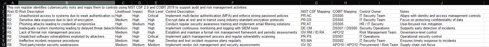
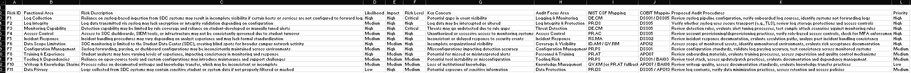
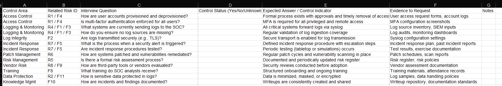

## ⚠️ Disclaimer

All materials in this repository have been sanitized and generalized for educational and portfolio purposes.  
No real organizational data, systems, or sensitive information are disclosed.

# cyber-risk-assessment-framework
Portfolio project demonstrating cybersecurity risk assessment, framework mapping, and audit planning using NIST CSF and COBIT.

# Cyber Risk Assessment Framework

This repository contains a sanitized portfolio version of an academic cybersecurity governance, risk, and audit planning project.

## Project Goals
- Perform a structured cybersecurity risk assessment
- Build a risk register with prioritization
- Map risks to NIST CSF 2.0 and COBIT 2019
- Develop an interview-based control assessment workflow
- Produce reusable audit and GRC templates

## Included Deliverables
- Risk register
- Functional risk assessment
- Risk assessment interview guide
- Reusable templates
- Methodology and framework mapping notes

## Frameworks Used
- NIST Cybersecurity Framework (CSF) 2.0
- COBIT 2019

## Repository Structure
- `docs/` project overview and methodology
- `deliverables/` finalized sanitized portfolio artifacts
- `templates/` reusable blank templates
- `references/` sources and framework notes

## 📊 Sample Deliverables Preview

### Risk Register

### Functional Risk Assessment

### Interview Guide

